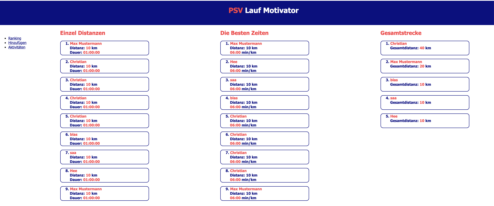
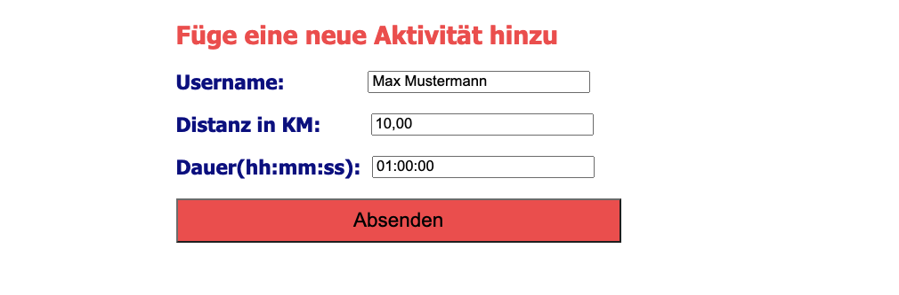
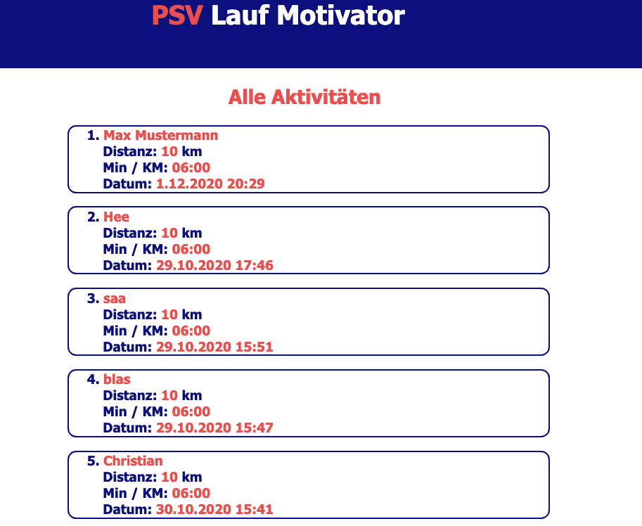

# Corona-Motivator
  

### About 
You and your friends can enter activities in the web application and a ranking is automatically made by it.
The ranking is divided in the three categories 
1. **the longest individual distance** 
2. **the fastest time** 
3. **the total distance of a user.**

There is also a page that shows all activities chronologically starting with the newest to the oldest.

#### The Ranking Site

- The Ranking Site shows the top ten entries in the respective category.
- Interesting here was to get the duration. First I used the [Duration Picker](https://www.npmjs.com/package/html-duration-picker) but after I got some troubles with formatting, I decided to use a string and split at the semicolons to get hh:mm:ss.
- The Layout is [CSS-Grid](https://css-tricks.com/snippets/css/complete-guide-grid/  ) based. I really like this technique to create a grid where you can easily set a row and a column to set the position of an html element. 

#### Add Activities

- When the button is clicked, I get the values ​​from the input fields, then I check the values and last but not least send them to my express endpoint. 
- At the endpoint I store the data in the mongodb database.

#### All Activities

#### Conclusion

- The project itself was not difficult at all but more important for me I get in touch with mongodb and heroku for the first time. I really enjoyed how easily you can start with these technologies.
- The reason is most likely that they have well written documentations and there are a lot of "question answers" on stackoverflow about it.
  
